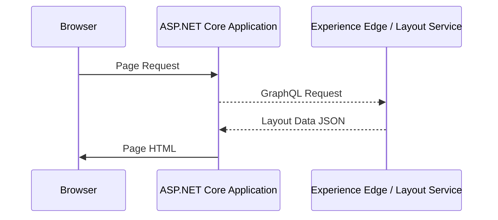
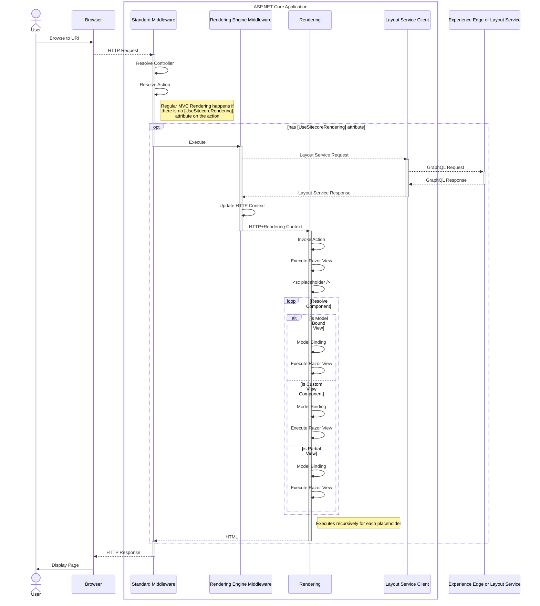

# Overview
The ASP.NET Core SDK is built to help developers leverage Sitecore Layout Data in their applications, to build layouts and hydrate components.

## Data flow
The SDK enables ASP.NET Core Applications to connect to a Sitecore instance of XM/XP or XMC and retrieve Layout Data. The Layout Data is a JSON object that represents the structure of a page in Sitecore. The Layout Data is used to render the page in the application.

### Basic Execution Sequence
The ASP.NET CoreSDK uses GraphQL to retrieve Layout Data in JSON format. When using Sitecore XM Cloud or Sitecore Experience Edge, the SDK connects to the Sitecore Experience Edge service to retrieve the Layout Data. 
When working with Sitecore XM or Sitecore XP CD servers, the SDK connects to the Sitecore Layout Service to retrieve the Layout Data. 

Below you can see a basic sequence diagram of the execution flow, showing how the data flows between the browser, the ASP.NET Core Application, and the Experience Edge or Layout Service.

### Full Execution Sequence
The full execution sequence is more detailed and shows how the Layout Data is used to render the page in the application. The sequence diagram below shows the full execution flow, including the rendering of the page in the application.

